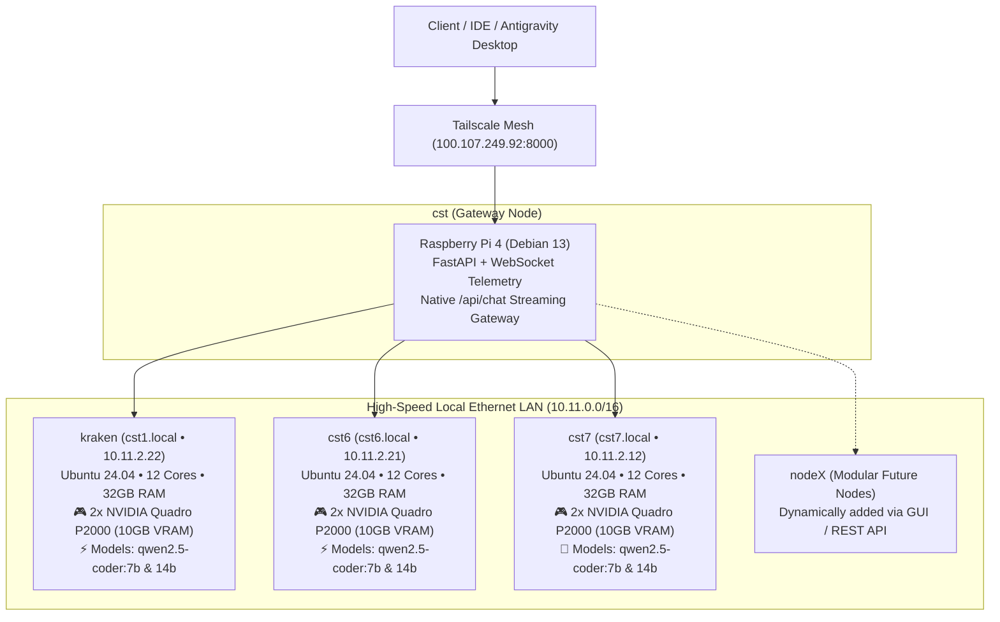

# ⚡ Courtesy: Autonomous Codex & AI Cluster Fleet

> A self-hosted, completely free alternative to OpenAI Codex, Claude Code, and Antigravity IDE, powered by your private multi-GPU cluster (**6x NVIDIA Quadro P2000 GPUs**, 30GB VRAM, 96GB RAM) with real-time server telemetry, modular node management, and an integrated Antigravity code workbench.

---

## 🏗️ System Architecture



---

## ✨ Features

- **Free Codex / Claude Alternative**: High-throughput coding assistant running entirely on your private cluster with 0 API token bills and 0 data leakage.
- **Dual GPU Acceleration per Node**: Multi-GPU layer splitting across dual Quadro P2000s on each compute server (6x GPUs total, 30GB VRAM).
- **Qwen 2.5 Coder Fleet**: Both **7B** (ultra-fast latency) and **14B** (deep architectural reasoning) installed across all cluster nodes.
- **Antigravity IDE Code Workbench**:
  - Split-pane layout with real-time Codex conversation on the left and active code scratchpad on the right.
  - Multi-language syntax highlighting, tab indentation, and language selection (Python, TypeScript, Rust, Go, C++, SQL, Bash).
  - Quick action chips: "Refactor", "Audit & Fix Bugs", "Generate Tests".
  - One-click "Send to Scratchpad" button on any generated response snippet.
- **Modular Server Fleet**: Dynamically register, toggle on/off, monitor, and remove compute nodes via the GUI or REST API (`/api/servers`).
- **Live Real-Time Telemetry**: Live WebSocket broadcast of CPU, RAM, dual GPU VRAM (MB & %), GPU compute utilization (%), and temperatures.
- **Intelligent Load Balancing & Failover**:
  - `auto`: Intelligently routes to the least-loaded or lowest-latency GPU node.
  - `qwen2.5-coder:7b`: Auto-balances across all nodes hosting the 7B model.
  - `qwen2.5-coder:14b`: Auto-balances across all nodes hosting the 14B model.
  - Direct pinning: e.g. `kraken/qwen2.5-coder:7b`, `cst6/qwen2.5-coder:7b`, `cst7/qwen2.5-coder:14b`.
- **Native Streaming `/api/chat` Gateway**: High-performance SSE token streaming with VRAM headroom preservation and optional live web grounding.

---

## 🚀 Quick Start

### Option 1: Launch Desktop App (Antigravity IDE GUI)
```powershell
.\launch-app.ps1
```
Launches the Electron desktop app connected directly to the persistent Pi cluster gateway (`100.107.249.92:8000`).

### Option 2: Access via Web Browser
Open:
- **Tailscale Mesh**: [http://100.107.249.92:8000](http://100.107.249.92:8000)
- **Local Network**: [http://cst:8000](http://cst:8000)

### Option 3: Run Full Stack Locally on Windows
```powershell
.\run.ps1
```

---

## 🔌 API & Client Integration

### 1. cURL Streaming Chat Request
```bash
curl -N -X POST http://100.107.249.92:8000/api/chat \
  -H "Content-Type: application/json" \
  -d '{
    "model": "auto",
    "messages": [{"role": "user", "content": "Write a quicksort in Rust."}],
    "stream": true
  }'
```

### 2. Python Streaming Client (`httpx`)
```python
import httpx
import json

payload = {
    "model": "auto",
    "messages": [{"role": "user", "content": "Write a quicksort in Rust."}],
    "stream": True
}

with httpx.stream("POST", "http://100.107.249.92:8000/api/chat", json=payload, timeout=60.0) as response:
    for line in response.iter_lines():
        if line.startswith("data: "):
            chunk = line[6:]
            if chunk == "[DONE]":
                break
            data = json.loads(chunk)
            print(data["choices"][0]["delta"]["content"], end="", flush=True)
```

---

## 📁 Repository Structure

```
courtesy/
├── config/
│   └── servers.json       # Modular server registry (kraken, cst6, cst7, cst)
├── src/
│   ├── app.py             # FastAPI REST & WebSocket server with /api/chat gateway
│   ├── config.py          # Dynamic configuration manager (CRUD)
│   ├── collector.py       # Asynchronous GPU & Ollama telemetry collector
│   └── router.py          # Intelligent load balancer & inference router
├── static/
│   ├── index.html         # Antigravity IDE & Codex playground
│   ├── app.js             # Telemetry UI logic, streaming chat, workspace explorer
│   └── styles.css         # Clean light/dark minimal theme & styling
├── electron/
│   ├── main.js            # Electron desktop window process
│   └── preload.js         # IPC security bridge
├── scripts/
│   └── test_inter_server.py # Cluster verification & inference test suite
├── launch-app.ps1         # 1-click Antigravity Desktop app launcher
├── run.ps1                # Windows local backend launcher
├── requirements.txt       # Python dependencies
└── README.md              # Documentation
```
