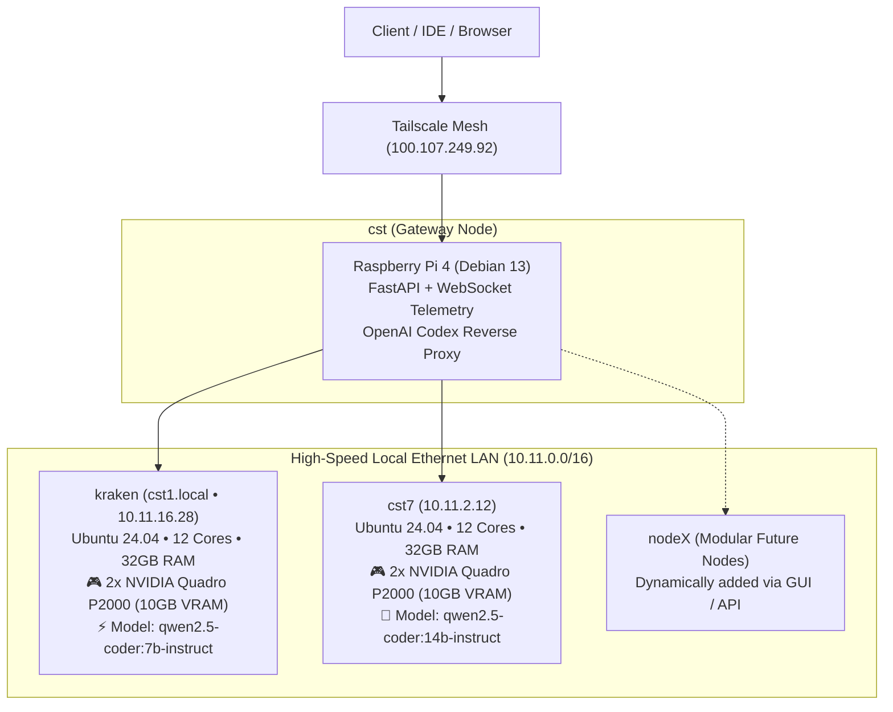

# ⚡ Courtesy: Autonomous Codex & AI Cluster Fleet

> A self-hosted, completely free alternative to OpenAI Codex and Claude Code, powered by your private GPU cluster (**4x NVIDIA Quadro P2000 GPUs**, 64GB RAM) with real-time server telemetry and modular node management.

---

## 🏗️ System Architecture



---

## ✨ Features

- **Free Codex / Claude Alternative**: High-throughput coding assistant running locally on your hardware with 0 API bills and 0 data leakage.
- **Dual GPU Acceleration per Node**: Automatic multi-GPU layer splitting across dual Quadro P2000s.
- **Modular Server Fleet**: Dynamically register, enable/disable, monitor, and remove compute nodes via the GUI or REST API (`/api/servers`).
- **Real-Time Live Telemetry**: Live WebSocket broadcast of CPU, RAM, dual GPU VRAM (MB & %), GPU compute utilization (%), and temperatures.
- **Intelligent Load Balancing & Failover**:
  - `auto`: Routes to the least-loaded or lowest-latency node.
  - `kraken`: Direct fast 7B code generation.
  - `cst7`: Deep architectural reasoning with the 14B model.
- **Standard OpenAI API**: Full compatibility with `/v1/chat/completions` (streaming SSE) and `/v1/models`.

---

## 🚀 Quick Start

### Option 1: Run Locally on Windows
```powershell
.\run.ps1
```
Open **http://localhost:8000** in your browser.

### Option 2: Deploy 24/7 on Raspberry Pi Gateway (`cst`)
Because `cst` is your persistent Tailscale gateway (`100.107.249.92`), deploying Courtesy directly onto `cst` allows you to access the dashboard and Codex API from your laptop, desktop, or mobile device from anywhere in the world.

Run this command from your terminal:
```bash
ssh cst@cst "git clone <repo> /opt/courtesy || rsync -avz courtesy/ cst@cst:/opt/courtesy"
ssh cst@cst "cd /opt/courtesy && bash deploy/setup-pi.sh"
```
Once deployed, access the dashboard at:
- **Web UI**: `http://100.107.249.92:8000` (or `http://cst:8000`)
- **OpenAI API Base**: `http://100.107.249.92:8000/v1`

---

## 🔌 IDE & Agent Integration

### 1. VS Code Continue.dev (`~/.continue/config.json`)
```json
{
  "models": [
    {
      "title": "Courtesy Codex (Auto Cluster)",
      "provider": "openai",
      "model": "auto",
      "apiBase": "http://100.107.249.92:8000/v1",
      "apiKey": "courtesy-local"
    },
    {
      "title": "Courtesy Kraken (Fast 7B)",
      "provider": "openai",
      "model": "kraken/qwen2.5-coder:7b-instruct-q4_K_M",
      "apiBase": "http://100.107.249.92:8000/v1",
      "apiKey": "courtesy-local"
    },
    {
      "title": "Courtesy CST7 (Heavy 14B)",
      "provider": "openai",
      "model": "cst7/qwen2.5-coder:14b-instruct",
      "apiBase": "http://100.107.249.92:8000/v1",
      "apiKey": "courtesy-local"
    }
  ]
}
```

### 2. Cline / Roo Code
- **API Provider**: `OpenAI Compatible`
- **Base URL**: `http://100.107.249.92:8000/v1`
- **API Key**: `courtesy`
- **Model ID**: `auto` (or `qwen2.5-coder:7b-instruct-q4_K_M`)

### 3. Aider CLI
```bash
aider --openai-api-base http://100.107.249.92:8000/v1 --openai-api-key courtesy --model openai/auto
```

### 4. Python OpenAI SDK
```python
from openai import OpenAI

client = OpenAI(
    base_url="http://100.107.249.92:8000/v1",
    api_key="courtesy-local"
)

response = client.chat.completions.create(
    model="auto",
    messages=[{"role": "user", "content": "Write a quicksort in Rust."}]
)
print(response.choices[0].message.content)
```

---

## 🧩 Adding New Servers (Modular Scaling)

You can add new servers dynamically at any time:

### Method A: Via the Web Dashboard
1. Click **"+ Add Server"** in the top right of the Fleet tab.
2. Enter the Server ID, Name, Host IP, Port (e.g. 11434), and SSH details.
3. Click **"Register Node"**. The cluster immediately starts polling metrics and indexing its models!

### Method B: Via `config/servers.json`
Add a new entry to `config/servers.json`:
```json
{
  "id": "cst8",
  "name": "Compute Node 3 (RTX 4090)",
  "role": "inference",
  "type": "ollama",
  "host": "10.11.2.18",
  "port": 11434,
  "ssh_host": "10.11.2.18",
  "ssh_user": "cst8",
  "enabled": true,
  "specs": {
    "cpu": "16 Cores",
    "ram": "64 GB",
    "gpus": [
      {"index": 0, "name": "NVIDIA GeForce RTX 4090", "vram_total_mb": 24576}
    ]
  },
  "tags": ["compute", "rtx4090", "heavy-inference"]
}
```

---

## 📁 Repository Structure

```
courtesy/
├── config/
│   └── servers.json       # Modular server registry & routing preferences
├── src/
│   ├── app.py             # FastAPI REST & WebSocket server
│   ├── config.py          # Dynamic configuration manager (CRUD)
│   ├── collector.py       # Asynchronous GPU & Ollama telemetry collector
│   ├── router.py          # Intelligent load balancer & inference router
│   └── openai_proxy.py    # OpenAI-compatible /v1/chat/completions gateway
├── static/
│   ├── index.html         # Responsive dashboard & Codex playground
│   ├── app.js             # Telemetry UI logic, streaming chat, server modals
│   └── styles.css         # Dark theme styling, progress gauges, syntax highlighting
├── deploy/
│   ├── setup-pi.sh        # Automated 1-command installer for cst (Pi)
│   └── courtesy.service   # Systemd unit file
├── requirements.txt       # Python dependencies
├── run.ps1                # Windows 1-click launcher
└── README.md              # Documentation
```
